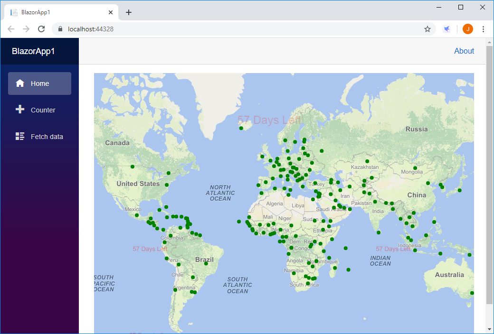

# Web Maps

## Repository Layout

`/api-docs`: An offline version the API documentation HTML pages.

`/hero-app`: A real world application that shows off many of this product's features using best practices.

`/samples`: A collection of feature by feature samples.  We suggest you start with the [How Do I Sample](samples/web-api) as it shows dozens of features in one easy to navigate app.

`/.assets`: Any assets needed for the readme.md.

`README.md`: A quick start guide to show you how to quickly get up and running.

## Introduction

Welcome, we're glad you're here!  If you're new to ThinkGeo's Web Maps we suggest that you start by taking a quick look below.  This will introduce you to getting a nice looking map up and running with some external data and styling.  After reviewing this we strongly recommend that you open the [How Do I Sample](samples).  It's packed with dozens of examples covering nearly everything you can do with the control.

### Recap

1. Take a quick look at the code below.
2. Open the [How Do I Sample](samples) and explore all our features.

## Samples

  We have a number of samples and the are

[check out HowDoI samples](samples)

## Display a Simple Map

We will begin by creating an **ASP.NET Core Web - API** project as the service and a **Blazor App** as the client to consuming the service in your favorite editor.  Next, we will walk you through adding the required packages and getting a map on the default form.  Then, we will add some code to show a nice looking background map, and finally, add some custom data to the map and style it.  After reading this, you will be in a good position to look over the [How Do I Sample](samples) and explore our other features.



### Step 1: Setup a New Project

In your editor of choice you need to create a **ASP.NET Core Web - API** project and a **Blazor App** project.  Please see your editor's instructions on how to create these projects.  We have included a guide in Visual Studio below.

[Visual Studio 2019 Example - ASP.NET Core Web - API](https://docs.microsoft.com/en-us/aspnet/core/tutorials/first-web-api?view=aspnetcore-3.1&tabs=visual-studio)

[Visual Studio 2019 Example - Blazor App](https://docs.microsoft.com/en-us/aspnet/core/blazor/get-started?view=aspnetcore-3.1&tabs=visual-studio&viewFallbackFrom=aspnetcore-3.0)

### Step 2: Add NuGet Packages

You will need to install the **ThinkGeo.UI.WebApi** NuGet package in **ASP.NET Core Web - API** project and **ThinkGeo.UI.Blazor** in **Blazor App** project.  We highly suggest you use your editors [built in NuGet package manager](https://docs.microsoft.com/en-us/nuget/quickstart/) if possible.  If you're not using an IDE you can [install it via the the dotnet CLI](https://docs.microsoft.com/en-us/nuget/consume-packages/install-use-packages-dotnet-cli) from inside your project folder where where your project file exists.

**ASP.NET Core Web - API** project

```shell
Install-Package ThinkGeo.UI.WebApi
```

**Blazor App** project

```shell
Install-Package ThinkGeo.UI.Blazor
```

### Step 3: Create "MapServiceController" by selecting "API Controller - Empty" template in `Controller` directory

Add the required usings in `MapServiceController.cs`.

```csharp
using ThinkGeo.Core;
```

Add an action method "GetCapitalData" with code below to serve features saved in demo data "capital.shp", following the [Mercator projection](https://en.wikipedia.org/wiki/Mercator_projection):

```csharp
[Route("getcapitals")]
[HttpGet]
public string GetCapitalData()
{
    // Capital layer
    var capitalSource = new ShapeFileFeatureSource(Path.Combine(AppContext.BaseDirectory, "../../../Data/capital.shp"));

    // Create the "Mercator projection" and apply it to the layer.
    var proj4 = new ProjectionConverter(Projection.GetWgs84ProjString(), Projection.GetSphericalMercatorProjString());
    if (!proj4.IsOpen) proj4.Open();
    capitalSource.ProjectionConverter = proj4;

    // Query all features with all attributes.
    capitalSource.Open();
    var queriedFeatures = capitalSource.GetAllFeatures(ReturningColumnsType.AllColumns);

    // Convert it to GeoJSON collection for return.
    GeometryCollectionShape returnedFeatures = new GeometryCollectionShape(queriedFeatures);
    return returnedFeatures.GetGeoJson();
}
```

### Step 4: Prepare spatial data required

Download the required spatial data from [GitLab](/samples/data) and put it into "Data" directory locating at the root project.

### Step 5: Create the HTML container of mapView

Open `~/Imports.razor` and add 2 using directives to reference the Map components.

```csharp
@using ThinkGeo.Core
@using ThinkGeo.UI.Blazor
```

Open the `~/Pages/_Host.cshtml` and add the stylesheet and javascript references of ThinkGeo Web For Blazor from CDN:

```html
<head>
    ...
    <link href="https://cdn.thinkgeo.com/blazor/1.0.0/blazor.css" rel="stylesheet" />
</head>

<body>
    ...
    <script src="https://cdn.thinkgeo.com/blazor/1.0.0/blazor.js"></script>
</body>
```

Open `~/Pages/Index.razor` file and add a ThinkGeo.UI.Blazor.Map component as following:
@page "/"

```html
<!--You can control the width and height in CSS too, if you like. -->
<MapView Id="demomap" MapUnit="@ThinkGeo.Core.GeographyUnit.Meter" Width="800" Height="600"  Zoom="3" Center="@(new PointShape(1056665.479014, 6066042.564712))">
    <OverlaysSetting>
        <!--Add the background world map-->
        <ThinkGeoCloudRasterMapsOverlay Id="RasterOverlay" MapType="ThinkGeo.Core.ThinkGeoCloudRasterMapsMapType.Light" ApiKey="Input your key"></ThinkGeoCloudRasterMapsOverlay>
    </OverlaysSetting>
</MapView>
```

### Step 6: Add a Point Data Layer

Add point capital `FeatureSource` to the map by adding one more `LayerOverlay` in MapView's  `OverlaysSetting`:

```html
<!--Add layer for hosting the point capital data requested from WebAPI project-->
<ThinkGeo.UI.Blazor.LayerOverlay Id="MapServiceOverlay" Layers="layers"></ThinkGeo.UI.Blazor.LayerOverlay>
```

And create an `InMemoryFeatureLayer` to host the point features pulling from the "GetCapitalData" action for render:

```csharp
@code {
    MapView map;
    GeoCollection<Layer> layers = new GeoCollection<Layer>();

    protected override void OnInitialized()
    {
        // URI of the GetCapitalData service endpoint.
        var geoJsonRequestUri = $"https://localhost:44316/api/MapService/getcapitals";

        // Submit the  request and pull capital point data down in geoJson format.
        var httpClient = new HttpClient();
        var requestBody = httpClient.GetStringAsync(geoJsonRequestUri).Result;
        var capitalPoints = (GeometryCollectionShape)GeometryCollectionShape.CreateShapeFromGeoJson(requestBody);

        // Create an InMemoryFeatureLayer to host the point features for render.
        InMemoryFeatureLayer capitalPointLayer = new InMemoryFeatureLayer();
        foreach (var capitalPoint in capitalPoints.Shapes)
        {
            capitalPointLayer.InternalFeatures.Add(new Feature(capitalPoint));
        }
        capitalPointLayer.ZoomLevelSet.ZoomLevel01.DefaultPointStyle = PointStyle.CreateSimpleCircleStyle(GeoColors.Green, 8);
        capitalPointLayer.ZoomLevelSet.ZoomLevel01.ApplyUntilZoomLevel = ApplyUntilZoomLevel.Level20;

        layers.Add(capitalPointLayer);
    }
}
```

### Step 7: Build and launch the blazor app

To make sure the **ASP.NET Core Web - API** project is running while the `Blazor App` is started, please open the "*.sln" solution property by "right-click solution -> Properties -> Common Properties:Startup Project -> Checked `Multiple startup projects`", and then press "F5" to launch the sample.

The first time you run your application, you will be presented with ThinkGeo's Product Center which will create and manage your licenses for all of ThinkGeo's products. Create a new account to begin a 60-day free evaluation.

1. Run the application in Debug mode.

1. Click the "Create a new Account?" link.

1. Fill out your name, email address, password and company name and click register.

1. Check your email and click the "Active Your Account" link.

1. Return to Product Center and login using the credentials your just created and hit "Continue Debugging" button.

You should now see your map with our Cloud Maps layer!
