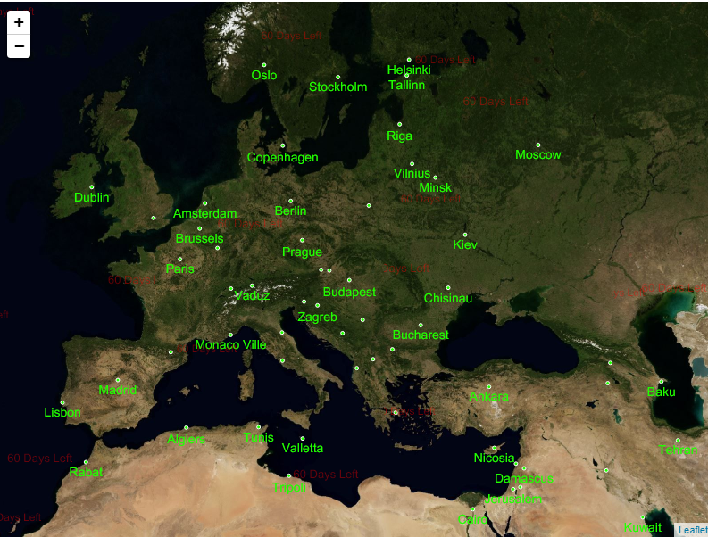
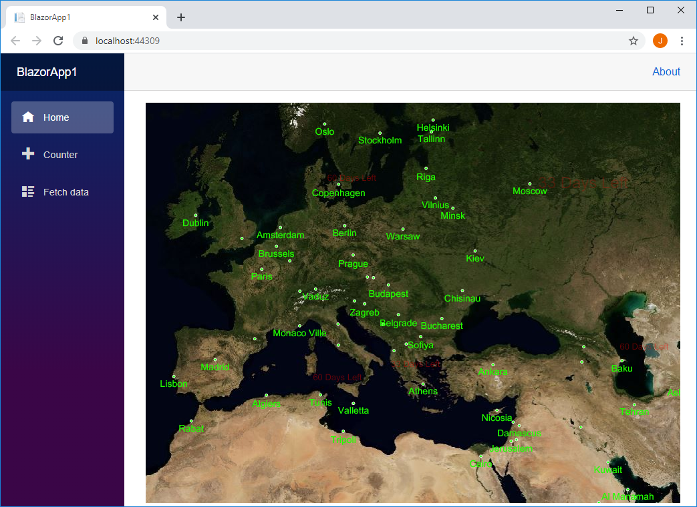

# Web Maps

## Repository Layout

`/docs`: An offline version the documentation HTML pages.

`/samples`: A collection of feature by feature samples.  We suggest you start with the [How Do I Sample](samples/web-api) as it shows dozens of features in one easy to navigate app.

`/assets`: Any assets needed for the README.

`README.md`: A quick start guide to show you how to quickly get up and running.

## Samples

We have a number of samples for both WebAPI and Blazor that show off ThinkGeo Web Maps' full capabilities. You can use these samples as a starting point for your own application, or simply reference them for how to use our controls using best practices.

- [WebAPI samples](samples/wep-api)
- [Blazor samples](samples/blazor)

## Quickstart Guides

- [WebAPI Quickstart](#quick-start-display-a-simple-map-on-webapi)
- [Blazor Quickstart](#quick-start-display-a-simple-map-on-blazor)

---

## Quick Start: Display a Simple Map on WebAPI

We will begin by creating an **ASP.NET Core Web - API** project as the service and a simple HTML-based sample with [Leaflet](https://leafletjs.com/) to consume the service. Next, we will walk you through adding the required packages and getting a Restful map service.  Then, we will add some code to show a nice looking background map, and finally, add some custom data to the map and style it. After reading this, you will be in a good position to look over the [How Do I Sample](samples/web-api) and explore our other features.



### Step 1: Setup a New Project

In your editor of choice you need to create a **ASP.NET Core Web - API** project.  Please see your editor's instructions on how to create this kind of project.  We have included a guide in Visual Studio below.

[Visual Studio 2019 Example - ASP.NET Core Web - API](https://docs.microsoft.com/en-us/aspnet/core/tutorials/first-web-api?view=aspnetcore-3.1&tabs=visual-studio)

### Step 2: Add NuGet Packages

You will need to install the **ThinkGeo.UI.WebApi** NuGet package in your **ASP.NET Core Web - API** project.  We highly suggest you use your editors [built in NuGet package manager](https://docs.microsoft.com/en-us/nuget/quickstart/) if possible.  If you're not using an IDE you can [install it via the the dotnet CLI](https://docs.microsoft.com/en-us/nuget/consume-packages/install-use-packages-dotnet-cli) from inside your project folder where where your project file exists.

```shell
Install-Package ThinkGeo.UI.WebApi
```

### Step 3: Prepare spatial data required

Download the required spatial data from [GitLab](assets/capital.zip) and extract its contents into "Data" directory located at the root project.

### Step 4: Create the Map API Controller

Create "MapServiceController" by selecting "API Controller - Empty" template in the `Controller` directory

Add the required usings in `MapServiceController.cs`.

```csharp
using ThinkGeo.Core;
```

Add an action method "GetTile" with code below to serve map tiles drawn with map data "capital.shp", following the [Mercator projection](https://en.wikipedia.org/wiki/Mercator_projection):

```csharp
 [Route("{z}/{x}/{y}")]
 [HttpGet]
 public IActionResult GetTile(int z, int x, int y)
 {
     // Create the LayerOverlay for displaying the map.
     LayerOverlay capitalOverlay = new LayerOverlay();

     // Create the point layer for capitals.
     ShapeFileFeatureLayer capitalFeatureLayer = new ShapeFileFeatureLayer(Path.Combine(AppContext.BaseDirectory, "../../../Data/capital.shp"));
     // Create the "Mercator projection" and apply it to the layer to match the background map.
     capitalFeatureLayer.FeatureSource.ProjectionConverter = new ProjectionConverter(Projection.GetWgs84ProjString(), Projection.GetSphericalMercatorProjString());

     // Create the point style for positions.
     capitalFeatureLayer.ZoomLevelSet.ZoomLevel01.DefaultPointStyle = new PointStyle(PointSymbolType.Circle, 4, new GeoSolidBrush(GeoColor.FromHtml("#21FF00")), new GeoPen(GeoColor.FromHtml("#ffffff"), 1));
     // Create the labeling style for capitals.
     capitalFeatureLayer.ZoomLevelSet.ZoomLevel01.DefaultTextStyle = new TextStyle("CITY_NAME", new GeoFont("Arial", 14), new GeoSolidBrush(GeoColor.FromHtml("#21FF00")));
     capitalFeatureLayer.ZoomLevelSet.ZoomLevel01.DefaultTextStyle.YOffsetInPixel = 5;
     capitalFeatureLayer.ZoomLevelSet.ZoomLevel01.ApplyUntilZoomLevel = ApplyUntilZoomLevel.Level20;
     // Set DrawingMarginPercentage to a proper value to avoid some labels are cut-off
     capitalFeatureLayer.DrawingMarginInPixel = 300;
     capitalOverlay.Layers.Add("street", capitalFeatureLayer);

     using (GeoImage image = new GeoImage(256, 256))
     {
         GeoCanvas geoCanvas = GeoCanvas.CreateDefaultGeoCanvas();
         RectangleShape boundingBox = WebApiExtentHelper.GetBoundingBoxForXyz(x, y, z, GeographyUnit.Meter);
         geoCanvas.BeginDrawing(image, boundingBox, GeographyUnit.Meter);

         if (capitalOverlay != null)
         {
             capitalOverlay.Draw(geoCanvas);
         }
         geoCanvas.EndDrawing();
         byte[] imageBytes = image.GetImageBytes(GeoImageFormat.Png);

         return File(imageBytes, "image/png");
     }
 }
```

### Step 5: Create HTML page "default.html" as client to consume the service

Add another pure HTML page "default.html" with following steps to consume the map tiles created previously.

> **NOTE:** The added "default.html" can be in created **ASP.NET Core Web - API** project, but please make sure run it from another place, such as in Visual Studio Code to make sure it doesn't share the same port of map service created.

 **Include Leaflet CSS file in the `<head>` section of your document:**

```html
 <link rel="stylesheet" href="https://unpkg.com/leaflet@1.6.0/dist/leaflet.css" />
```

**Include Leaflet JavaScript file after Leaflet’s CSS:**

```html
 <!-- Make sure you put this AFTER Leaflet's CSS -->
 <script src="https://unpkg.com/leaflet@1.6.0/dist/leaflet.js></script>
```

**Put a `<div>` element with an id of `map` in the html's `<body>`:**

```html
 <div id="map"></div>
```

**Make sure the map container has a defined width and height, for example by setting it in CSS:**

```css
#map { width: 800px; height:600px }
```

**Add a `<script>` element below the map div**

```html
<script>
    // JS code goes here
</script>
```

Now you’re ready to initialize the map and consume the map tile services with following code:

```javascript

// Create the map.
var map = L.map('map').setView([33.1010, -96.8134], 4);

//
var cloudApiKey = 'YOUR THINKGEO CLOUD MAPS API KEY';
// Add ThinkGeoCloudMaps as the base map.
var thinkgeoCloudMapsLayer = L.tileLayer('https://{s}.thinkgeo.com/api/v1/maps/raster/aerial/x1/3857/512/{z}/{x}/{y}.jpeg?apikey=' + cloudApiKey, {
    subdomains: ['cloud1', 'cloud2', 'cloud3', 'cloud4', 'cloud5', 'cloud6'],
    layers: 'ThinkGeoCloudMaps',
    format: 'image/png',
    styles: 'aerial',
    version: '1.1.1'
});
thinkgeoCloudMapsLayer.addTo(map);

// Add base street layer without any label from the web API controller of this Project.
var capitalLayer = L.tileLayer('https://localhost:44350/mapservice/{z}/{x}/{y}').addTo(map);
```

That’s it! You have a working Leaflet map now.

The first time you run your **ASP.NET Core Web - API** project, you will be presented with ThinkGeo's Product Center which will create and manage your licenses for all of ThinkGeo's products. Create a new account to begin a 60-day free evaluation.

1. Run the application in Debug mode.
1. Click the "Create a new Account?" link.
1. Fill out your name, email address, password and company name and click register.
1. Check your email and click the "Active Your Account" link.
1. Return to Product Center and login using the credentials your just created and hit "Continue Debugging" button.

You should now see your map with our Cloud Maps layer!

You are now in a great position to look over the [other samples available](https://gitlab.com/thinkgeo/public/thinkgeo-web-maps/-/tree/master/samples/web-api) and explore our other features.

---

## Quick Start: Display a Simple Map on Blazor

We will begin by creating a **Blazor App** as the client to consuming the service in your favorite editor.  Next, we will walk you through adding the required packages and getting a map on the default form.  Then, we will add some code to show a nice looking background map, and finally, add some custom data to the map and style it.  After reading this, you will be in a good position to look over the [How Do I Sample](samples/blazor) and explore our other features.



### Step 1: Setup a New Project

In your editor of choice you need to create a **Blazor App** project.  Please see your editor's instructions on how to create these projects.  We have included a guide in Visual Studio below.

[Visual Studio 2019 Example - Blazor App](https://docs.microsoft.com/en-us/aspnet/core/blazor/get-started?view=aspnetcore-3.1&tabs=visual-studio&viewFallbackFrom=aspnetcore-3.0)

### Step 2: Add NuGet Packages

You will need to install **ThinkGeo.UI.Blazor** in **Blazor App** project.  We highly suggest you use your editors [built in NuGet package manager](https://docs.microsoft.com/en-us/nuget/quickstart/) if possible.  If you're not using an IDE you can [install it via the the dotnet CLI](https://docs.microsoft.com/en-us/nuget/consume-packages/install-use-packages-dotnet-cli) from inside your project folder where where your project file exists.

```shell
Install-Package ThinkGeo.UI.Blazor
```

### Step 3: Create a world map

- **Add using Reference** - Open `~/Imports.razor` and add 2 using directives to reference the Map components.

    ```csharp
    @using ThinkGeo.Core
    @using ThinkGeo.UI.Blazor
    ```

- **Add stylesheet and JavaScript references** - Open the `~/Pages/_Host.cshtml` and add the stylesheet and javascript references of ThinkGeo Web For Blazor from CDN:

    ```html
        <head>
            ...
            <link href="https://cdn.thinkgeo.com/blazor/1.0.0/blazor.css" rel="stylesheet" />
        </head>

        <body>
            ...
            <script src="https://cdn.thinkgeo.com/blazor/1.0.0/blazor.js"></script>
        </body>
    ```

- **Add ThinkGeo.UI.Blazor map component** - Open `~/Pages/Index.razor` file and add a `ThinkGeo.UI.Blazor.Map` component as following:

    ```html
    @page "/"

    <!--You can control the width and height in CSS too, if you like. -->
    <MapView Id="demomap" MapUnit="@ThinkGeo.Core.GeographyUnit.Meter" Zoom="3" Width="800" Height="600">
        <OverlaysSetting>
            <ThinkGeoCloudRasterMapsOverlay Id="RasterOverlay" MapType="ThinkGeo.Core.ThinkGeoCloudRasterMapsMapType.Aerial" ApiKey="YOUR CLOUD API KEY"></ThinkGeoCloudRasterMapsOverlay>
        </OverlaysSetting>
    </MapView>
    ```

**NOTE:** It requires an APIKey of ThinkGeo Cloud, and you can get the API Key from the registration email. If you don't have an account of ThinkGeo Cloud yet, please refer to [ThinkGeo Cloud Maps client keys guide](https://docs.thinkgeo.com/products/cloud-maps/v12.0/client-keys/) to get your ThinkGeo Cloud account.

The first time you run your **ThinkGeo.UI.Blazor** project, you will be presented with ThinkGeo's Product Center which will create and manage your licenses for all of ThinkGeo's products. Create a new account to begin a 60-day free evaluation.

1. Run the application in Debug mode.
1. Click the "Create a new Account?" link.
1. Fill out your name, email address, password and company name and click register.
1. Check your email and click the "Active Your Account" link.
1. Return to Product Center and login using the credentials your just created and hit "Continue Debugging" button.

You should now see your map with our Cloud Maps layer!

### Step 4: Prepare spatial data required

Download the required spatial data from [GitLab](assets/capital.zip) and extract its contents into the "Data" directory located at the root project.

### Step 5: Add a Point Data Layer

Add point capital `FeatureLayer` to the map by adding one more `LayerOverlay` in MapView's  `OverlaysSetting`:

```html
<!--You can control the width and height in CSS too, if you like. -->
<MapView Id="demomap" MapUnit="@ThinkGeo.Core.GeographyUnit.Meter" Zoom="3" Width="800" Height="600">
    <OverlaysSetting>
        <ThinkGeoCloudRasterMapsOverlay Id="RasterOverlay" MapType="ThinkGeo.Core.ThinkGeoCloudRasterMapsMapType.Aerial" ApiKey="YOUR CLOUD API KEY"></ThinkGeoCloudRasterMapsOverlay>
        <!--Add one more Overlay for hosting capital FeatureLayer. -->
        <LayerOverlay Id="capitalOverlay" Layers="@layers"></LayerOverlay>
    </OverlaysSetting>
</MapView>
```

Create the `FeatureLayer` with the data "capital.shp" saved in "Data" directory:

```csharp
@code {
    GeoCollection<Layer> layers = new GeoCollection<Layer>();

    protected override void OnInitialized()
    {
        // Create the point layer for capitals.
        ShapeFileFeatureLayer capitalFeatureLayer = new ShapeFileFeatureLayer("./Data/capital.shp");
        // Create the "Mercator projection" and apply it to the layer to match the background map.
        capitalFeatureLayer.FeatureSource.ProjectionConverter = new ProjectionConverter(Projection.GetWgs84ProjString(), Projection.GetSphericalMercatorProjString());

        // Create the point style for positions.
        capitalFeatureLayer.ZoomLevelSet.ZoomLevel01.DefaultPointStyle = new PointStyle(PointSymbolType.Circle, 4, new GeoSolidBrush(GeoColor.FromHtml("#21FF00")), new GeoPen(GeoColor.FromHtml("#ffffff"), 1));
        // Create the labeling style for capitals.
        capitalFeatureLayer.ZoomLevelSet.ZoomLevel01.DefaultTextStyle = new TextStyle("CITY_NAME", new GeoFont("Arial", 14), new GeoSolidBrush(GeoColor.FromHtml("#21FF00")));
        capitalFeatureLayer.ZoomLevelSet.ZoomLevel01.DefaultTextStyle.YOffsetInPixel = 5;
        capitalFeatureLayer.ZoomLevelSet.ZoomLevel01.ApplyUntilZoomLevel = ApplyUntilZoomLevel.Level20;
        // Set DrawingMarginPercentage to a proper value to avoid some labels are cut-off
        capitalFeatureLayer.DrawingMarginInPixel = 300;

        layers.Add(capitalFeatureLayer);
    }
}
```

### Step 6: Build and launch the blazor app

After build and run the `blazor app` in browser, you should now see your map with our Cloud Maps layer and capital labels.

---

## Need Help?

If you run into any issues with running the samples, please let us know in the [Community Forums](https://community.thinkgeo.com).

If you have any questions about the product or sales, please contact us at [sales@thinkgeo.com](mailto:sales@thinkgeo.com).
