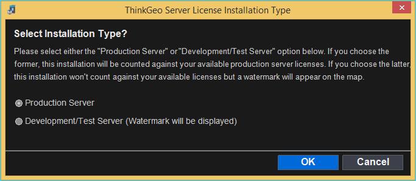
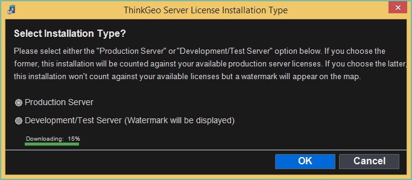

# Deployment

## Web API

If we want to publish our WebAPI application with ThinkGeo Components to a server, it is required to setup the deployment license, or a map will be rendered with a "Not Licensed For Run Time" watermark. This guide will introduce you how to setup the deployment license with ThinkGeo Product Center.

1. Copy ThinkGeo.ProductCenter.exe from the development machine to your deployment server. The Product Center executable can be found in the “bin/debug” folder of the developing project after the project is compiled. Log into the Product Center, if you have purchased the web products, the “Setup Deployment Server” button will be available on the right side panel.
   
    

1. Click “Setup Deployment Server” button. The server deployment dialog will pop up as seen in the following snapshot:

    

1. Click “OK” to get your deployment license ready. It might take a few seconds to complete.

    

1.  Once setup is finished, the "Not Licensed for Run Time" watermark will be gone.

## Blazor

If we want to publish our blazor application with ThinkGeo Components to a server, it is required to setup the deployment license, or a map will be rendered with a "Not Licensed For Run Time" watermark. This guide will introduce you how to setup the deployment license with ThinkGeo Product Center.

## Setup Deployment Server

Please follow the below steps to setup the deployment license.

1. Copy ThinkGeo.ProductCenter.exe from the development machine to your deployment server. The Product Center executable can be found in the “bin/debug” folder of the developing project after the project is compiled. Log into the Product Center, if you have purchased the web products, the “Setup Deployment Server” button will be available on the right side panel.

    

1. Click “Setup Deployment Server” button. The server deployment dialog will pop up as seen in the following snapshot:

    

1. Click “OK” to get your deployment license ready. It might take a few seconds to complete.

    

1. Once setup is finished, the "Not Licensed for Run Time" watermark will gone.
